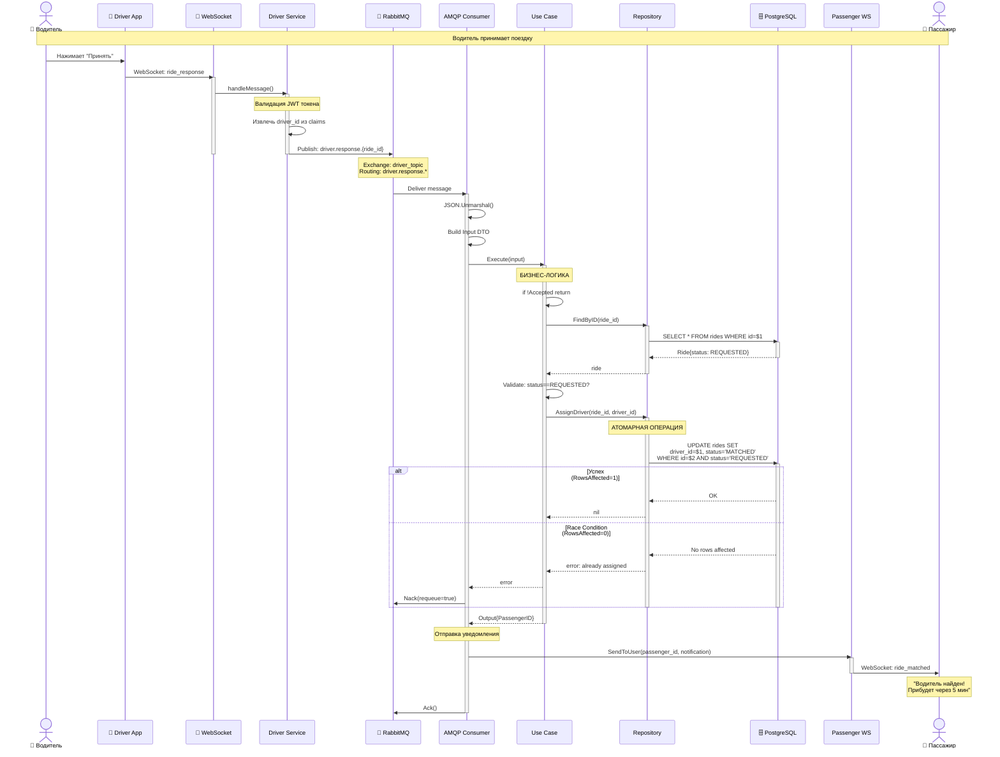

# 📊 Диаграммы: Поток назначения водителя

> Визуализация работы системы для лучшего понимания

## Sequence Diagram (Диаграмма последовательности)



## Component Diagram (Компонентная диаграмма)

```
┌─────────────────────────────────────────────────────────────────┐
│                         Ride Service                             │
│                                                                  │
│  ┌──────────────────────────────────────────────────────────┐   │
│  │              ADAPTERS (Внешний слой)                     │   │
│  │                                                           │   │
│  │  ┌─────────────────┐          ┌──────────────────┐      │   │
│  │  │  HTTP Handler   │          │  RabbitMQ        │      │   │
│  │  │  (REST API)     │          │  Consumer        │◄─────┼───┼─── RabbitMQ
│  │  └────────┬────────┘          └────────┬─────────┘      │   │
│  │           │                            │                 │   │
│  └───────────┼────────────────────────────┼─────────────────┘   │
│              │                            │                     │
│  ┌───────────┼────────────────────────────┼─────────────────┐   │
│  │           │     PORTS (Интерфейсы)     │                 │   │
│  │           ▼                            ▼                 │   │
│  │  ┌──────────────────┐        ┌──────────────────┐       │   │
│  │  │  RequestRide     │        │  HandleDriver    │       │   │
│  │  │  UseCase         │        │  ResponseUseCase │       │   │
│  │  └──────────────────┘        └──────────────────┘       │   │
│  │                                                          │   │
│  └──────────────────────────────────────────────────────────┘   │
│                                                                  │
│  ┌──────────────────────────────────────────────────────────┐   │
│  │          APPLICATION (Бизнес-логика)                     │   │
│  │                                                           │   │
│  │  ┌────────────────────────────────────────────────┐      │   │
│  │  │  HandleDriverResponseService                   │      │   │
│  │  │                                                │      │   │
│  │  │  Execute():                                    │      │   │
│  │  │  1. Validate input.Accepted                   │      │   │
│  │  │  2. FindByID(ride_id)                         │      │   │
│  │  │  3. Check status == REQUESTED                 │      │   │
│  │  │  4. AssignDriver()                            │      │   │
│  │  │  5. Return PassengerID                        │      │   │
│  │  └────────────────────────────────────────────────┘      │   │
│  │                          │                               │   │
│  │                          ▼                               │   │
│  │              ┌───────────────────────┐                   │   │
│  │              │  RideRepository       │                   │   │
│  │              │  (Interface)          │                   │   │
│  │              └───────────┬───────────┘                   │   │
│  └──────────────────────────┼───────────────────────────────┘   │
│                             │                                   │
│  ┌──────────────────────────┼───────────────────────────────┐   │
│  │  ADAPTERS (Внешний слой) │                               │   │
│  │                          ▼                               │   │
│  │              ┌───────────────────────┐                   │   │
│  │              │  RidePgRepository     │                   │   │
│  │              │  (PostgreSQL impl)    │                   │   │
│  │              └───────────┬───────────┘                   │   │
│  │                          │                               │   │
│  └──────────────────────────┼───────────────────────────────┘   │
│                             ▼                                   │
└─────────────────────────────────────────────────────────────────┘
                              │
                              ▼
                    ┌──────────────────┐
                    │   PostgreSQL     │
                    │   + PostGIS      │
                    └──────────────────┘
```

## Data Flow Diagram (Поток данных)

```
Водитель нажимает "Принять"
    │
    ├─► 1. WebSocket Message
    │      {
    │        "type": "ride_response",
    │        "data": {
    │          "ride_id": "uuid-123",
    │          "accepted": true
    │        }
    │      }
    │
    ▼
Driver Service (WebSocket Handler)
    │
    ├─► 2. Extract driver_id from JWT
    │
    ├─► 3. RabbitMQ Publish
    │      Exchange: driver_topic
    │      Routing Key: driver.response.uuid-123
    │      Payload: DriverResponseDTO{...}
    │
    ▼
RabbitMQ (Message Broker)
    │
    ├─► 4. Route to Queue
    │      Pattern Match: driver.response.* ✓
    │      Queue: ride_service_driver_responses
    │
    ▼
Ride Service (AMQP Consumer)
    │
    ├─► 5. JSON Parse
    │      DriverResponseMessage → HandleDriverResponseInput
    │
    ├─► 6. Use Case Call
    │      handleDriverResponseUseCase.Execute(input)
    │
    ▼
HandleDriverResponseService
    │
    ├─► 7. Business Logic
    │      ├─ if !Accepted: return (найти другого водителя)
    │      ├─ FindByID(ride_id) → Ride
    │      ├─ Validate: ride.Status == "REQUESTED"
    │      └─ AssignDriver(ride_id, driver_id)
    │
    ▼
RidePgRepository
    │
    ├─► 8. SQL Execution
    │      UPDATE rides 
    │      SET driver_id = $1, status = 'MATCHED'
    │      WHERE id = $2 AND status = 'REQUESTED'
    │
    ├─► 9. Check RowsAffected
    │      = 0: error (race condition)
    │      = 1: success
    │
    ▼
Return to Consumer
    │
    ├─► 10. Send WebSocket to Passenger
    │       passengerWS.SendToUser(output.PassengerID, {
    │         "type": "ride_matched",
    │         "driver_id": input.DriverID,
    │         "eta": 5
    │       })
    │
    ├─► 11. Ack Message
    │       msg.Ack(false)
    │
    ▼
Пассажир видит уведомление
"Водитель найден! Прибудет через 5 минут"
```

## Error Handling Flow (Обработка ошибок)

```
Consumer получает сообщение
    │
    ├─► Парсинг JSON
    │      ├─ Success → продолжаем
    │      └─ Error → Nack(requeue=true) ← Попробуем еще раз
    │
    ├─► Use Case Execute
    │      │
    │      ├─► Validate Accepted
    │      │      └─ false → return Output{Status: REQUESTED}
    │      │
    │      ├─► FindByID
    │      │      ├─ Success → ride
    │      │      └─ Error → return error → Nack(requeue=true)
    │      │
    │      ├─► Validate Status
    │      │      ├─ REQUESTED → продолжаем
    │      │      └─ MATCHED/другой → return error → Nack(requeue=true)
    │      │
    │      └─► AssignDriver
    │             ├─ RowsAffected=1 → Success
    │             └─ RowsAffected=0 → Error: already assigned
    │                                 │
    │                                 └─► Возвращаем ошибку
    │                                     │
    │                                     └─► Consumer: Nack(requeue=true)
    │                                         │
    │                                         └─► Сообщение вернется в очередь
    │                                             │
    │                                             └─► Retry через несколько секунд
    │
    └─► WebSocket Send
           ├─ Success → Ack(false) ← Удалить из очереди
           └─ Error → Логируем, но все равно Ack()
                      (данные уже в БД, WebSocket - best effort)
```

## Race Condition Prevention (Защита от состояния гонки)

```
Время →

t=0    Driver_A принимает поездку
       │
       ├─► WebSocket → RabbitMQ → Consumer_1
       │
t=100  Driver_B принимает поездку (одновременно!)
       │
       └─► WebSocket → RabbitMQ → Consumer_2


t=200  Consumer_1: UPDATE rides WHERE status='REQUESTED'
       │  ├─ status = REQUESTED ✓
       │  ├─ SET driver_id = A, status = MATCHED
       │  └─ RowsAffected = 1 ✓ SUCCESS
       │

t=201  Consumer_2: UPDATE rides WHERE status='REQUESTED'
       │  ├─ status = MATCHED (изменено Consumer_1!)
       │  ├─ WHERE condition НЕ выполнено
       │  └─ RowsAffected = 0 ✗ FAILURE
       │
       └─► Error: "ride not found or already assigned"
           │
           └─► Nack(requeue=true)
               │
               └─► Driver_B получит другую поездку


Результат:
├─ Ride назначена Driver_A ✓
├─ Driver_B получил ошибку ✓
└─ Данные консистентны ✓
```

## Database Schema (Схема БД)

```sql
-- Таблица поездок
CREATE TABLE rides (
    id UUID PRIMARY KEY DEFAULT gen_random_uuid(),
    
    -- Участники
    passenger_id UUID NOT NULL REFERENCES users(id),
    driver_id UUID REFERENCES users(id),  -- NULL до назначения!
    
    -- Статусы (enum)
    status TEXT REFERENCES ride_status(value),
    -- REQUESTED → MATCHED → EN_ROUTE → ARRIVED → 
    -- IN_PROGRESS → COMPLETED | CANCELLED
    
    -- Временные метки
    created_at TIMESTAMPTZ DEFAULT NOW(),
    requested_at TIMESTAMPTZ DEFAULT NOW(),
    matched_at TIMESTAMPTZ,      -- ← Заполняется при AssignDriver()
    started_at TIMESTAMPTZ,
    completed_at TIMESTAMPTZ,
    
    -- Координаты
    pickup_coordinate_id UUID REFERENCES coordinates(id),
    destination_coordinate_id UUID REFERENCES coordinates(id),
    
    -- Финансы
    estimated_fare DECIMAL(10,2),
    final_fare DECIMAL(10,2)
);

-- Индексы для производительности
CREATE INDEX idx_rides_status ON rides(status);
CREATE INDEX idx_rides_driver ON rides(driver_id) WHERE driver_id IS NOT NULL;
CREATE INDEX idx_rides_passenger ON rides(passenger_id);

-- Enum статусов
CREATE TABLE ride_status (
    value TEXT PRIMARY KEY
);

INSERT INTO ride_status VALUES 
    ('REQUESTED'),   -- Пассажир создал заказ
    ('MATCHED'),     -- Водитель назначен ← AssignDriver()
    ('EN_ROUTE'),    -- Водитель едет к точке pickup
    ('ARRIVED'),     -- Водитель прибыл
    ('IN_PROGRESS'), -- Поездка началась
    ('COMPLETED'),   -- Поездка завершена
    ('CANCELLED');   -- Отменена
```

---

**Легенда символов**:
- 🚗 Водитель
- 👤 Пассажир  
- 📱 Мобильное приложение
- 🔌 WebSocket соединение
- 🐰 RabbitMQ
- 🗄️ База данных PostgreSQL
- ✓ Успех
- ✗ Ошибка
