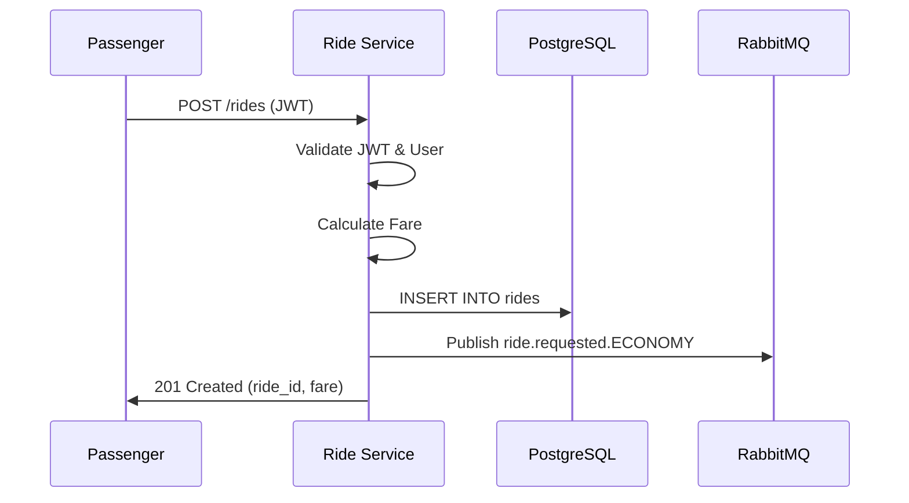
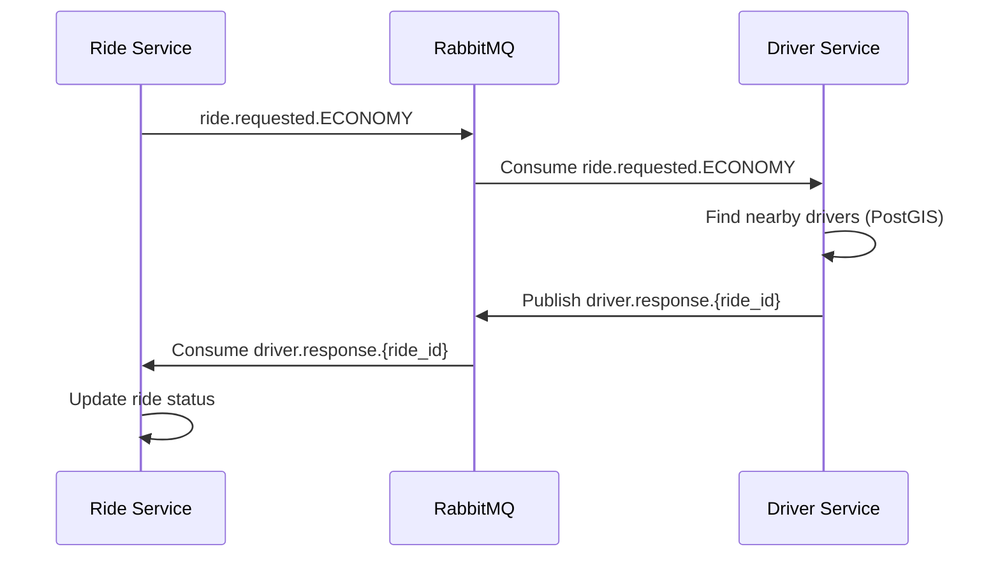

# 🚗 Ride Service Testing Guide

## Overview

Ride Service предоставляет API для создания поездок (ride requests) с автоматическим расчётом стоимости на основе типа автомобиля и расстояния.

## Test Coverage

### Automated Test Suite: **8/8 Tests Passing** ✅

Скрипт: `./scripts/test-ride-api.sh`

#### Test Cases:

1. **Health Check** ✅
   - Проверка доступности сервиса
   - Endpoint: `GET /health`
   - Expected: `{"status":"ok"}`

2. **Request ECONOMY Ride** ✅
   - Создание поездки эконом-класса
   - Route: Almaty Central Park → Kok-Tobe Hill (~5 км)
   - Estimated Fare: **104.34₸** (базовая ставка 500₸ + 100₸/км)
   - Expected Status: `REQUESTED`

3. **Request PREMIUM Ride** ✅
   - Создание поездки премиум-класса
   - Route: Mega Alma-Ata → Almaty Central Park (~4 км)
   - Estimated Fare: **193.31₸** (базовая ставка 800₸ + 120₸/км)
   - Expected Status: `REQUESTED`

4. **Request XL Ride** ✅
   - Создание поездки класса XL
   - Route: Kok-Tobe Hill → Almaty Central Park (~5 км)
   - Estimated Fare: **152.45₸** (базовая ставка 1000₸ + 150₸/км)
   - Expected Status: `REQUESTED`

5. **Invalid Coordinates** ✅
   - Отклонение запроса с невалидными координатами (lat: 91.0, lng: 181.0)
   - Expected: `{"error":"invalid coordinates: latitude must be between -90 and 90"}`

6. **Invalid Vehicle Type** ✅
   - Отклонение запроса с неподдерживаемым типом автомобиля
   - Expected: `{"error":"invalid vehicle type"}`

7. **Missing Required Fields** ✅
   - Отклонение запроса с отсутствующими обязательными полями
   - Expected: `{"error":"pickup_address is required"}`

8. **Invalid Token** ✅
   - Отклонение запроса с невалидным JWT токеном
   - Expected: `{"error":"invalid or expired token"}`

## Quick Start

### 1. Setup Test Passenger

```bash
./scripts/setup-test-passenger.sh
```

Creates a test passenger user:
- Email: `passenger@ridehail.com`
- Role: `PASSENGER`
- Status: `ACTIVE`

### 2. Run Automated Tests

```bash
./scripts/test-ride-api.sh
```

Expected output: **8/8 tests passing** ✅

## Manual Testing

### Prerequisites

1. Ensure all services are running:
```bash
./scripts/system-status.sh
```

2. Get passenger ID:
```bash
ADMIN_TOKEN=$(go run cmd/generate-jwt/main.go \
  -user="11111111-1111-1111-1111-111111111111" \
  -email="admin@ridehail.com" \
  -role=ADMIN \
  2>/dev/null | grep '^eyJ' | head -n1 | xargs)

USERS_RESPONSE=$(curl -s "http://localhost:3004/admin/users?role=PASSENGER&limit=1" \
  -H "Authorization: Bearer $ADMIN_TOKEN")

PASSENGER_ID=$(echo "$USERS_RESPONSE" | grep -o '"user_id":"[^"]*"' | head -n1 | cut -d'"' -f4)
echo "Passenger ID: $PASSENGER_ID"
```

3. Generate passenger token:
```bash
PASSENGER_TOKEN=$(go run cmd/generate-jwt/main.go \
  -user="$PASSENGER_ID" \
  -email="passenger@ridehail.com" \
  -role=PASSENGER \
  2>/dev/null | grep '^eyJ' | head -n1 | xargs)

echo "Token: $PASSENGER_TOKEN"
```

### Test Scenarios

#### 1. Create ECONOMY Ride

```bash
curl -X POST "http://localhost:3000/rides" \
  -H "Content-Type: application/json" \
  -H "Authorization: Bearer $PASSENGER_TOKEN" \
  -d '{
    "vehicle_type": "ECONOMY",
    "pickup_lat": 43.238949,
    "pickup_lng": 76.889709,
    "pickup_address": "Almaty Central Park",
    "destination_lat": 43.222015,
    "destination_lng": 76.851511,
    "destination_address": "Kok-Tobe Hill"
  }' | jq '.'
```

**Expected Response:**
```json
{
  "ride_id": "uuid-here",
  "ride_number": "RIDE-20251031-XXXXXX",
  "status": "REQUESTED",
  "estimated_fare": 104.34,
  "pickup_address": "Almaty Central Park",
  "destination_address": "Kok-Tobe Hill"
}
```

#### 2. Create PREMIUM Ride

```bash
curl -X POST "http://localhost:3000/rides" \
  -H "Content-Type: application/json" \
  -H "Authorization: Bearer $PASSENGER_TOKEN" \
  -d '{
    "vehicle_type": "PREMIUM",
    "pickup_lat": 43.256910,
    "pickup_lng": 76.928640,
    "pickup_address": "Mega Alma-Ata",
    "destination_lat": 43.238949,
    "destination_lng": 76.889709,
    "destination_address": "Almaty Central Park",
    "priority": 5
  }' | jq '.'
```

#### 3. Create XL Ride

```bash
curl -X POST "http://localhost:3000/rides" \
  -H "Content-Type: application/json" \
  -H "Authorization: Bearer $PASSENGER_TOKEN" \
  -d '{
    "vehicle_type": "XL",
    "pickup_lat": 43.222015,
    "pickup_lng": 76.851511,
    "pickup_address": "Kok-Tobe Hill",
    "destination_lat": 43.238949,
    "destination_lng": 76.889709,
    "destination_address": "Almaty Central Park"
  }' | jq '.'
```

## Fare Calculation

### Formula

```
Estimated Fare = Base Fare + (Distance × Per-Km Rate) + (Duration × Per-Min Rate)
```

### Rate Card

| Vehicle Type | Base Fare | Per Km | Per Min |
|-------------|-----------|--------|---------|
| ECONOMY     | 500₸      | 100₸   | 10₸     |
| PREMIUM     | 800₸      | 120₸   | 12₸     |
| XL          | 1000₸     | 150₸   | 15₸     |

### Distance Estimation

Distance calculated using Haversine formula:
```go
distance = acos(
    sin(lat1) * sin(lat2) + 
    cos(lat1) * cos(lat2) * cos(lng2 - lng1)
) * 6371.0  // Earth's radius in km
```

### Duration Estimation

```go
duration = (distance / 30.0) * 60.0  // Assuming 30 km/h average speed
```

## Implementation Status

### ✅ Completed

- **HTTP API**: POST /rides endpoint
- **Authentication**: JWT middleware with user validation
- **Use Case**: Request ride logic with fare calculation
- **Domain**: Ride entity, coordinate value object, events
- **Validation**: Coordinates, vehicle type, required fields
- **Error Handling**: Proper HTTP status codes and error messages
- **Database**: Ride persistence to `rides` table
- **Event Publishing**: Ride requested event to RabbitMQ
- **Testing**: Comprehensive automated test suite (8 tests)

### ⚠️ Pending

- **WebSocket**: Real-time updates for passengers
- **RabbitMQ Consumers**: 
  - Driver response consumer (handle_driver_response_usecase)
  - Location update consumer
- **Additional Endpoints**:
  - GET /rides/{id} - Get ride details
  - GET /rides - List passenger's rides
  - POST /rides/{id}/cancel - Cancel ride
- **Matching Algorithm**: Integration with driver matching
- **Event Sourcing**: Store events in `ride_events` table

## Database Schema

### rides table

```sql
CREATE TABLE rides (
    id UUID PRIMARY KEY,
    ride_number VARCHAR(64) UNIQUE NOT NULL,
    passenger_id UUID NOT NULL REFERENCES users(id),
    vehicle_type VARCHAR(20) NOT NULL CHECK (vehicle_type IN ('ECONOMY', 'PREMIUM', 'XL')),
    status VARCHAR(20) NOT NULL CHECK (status IN ('REQUESTED', 'MATCHED', 'ACCEPTED', ...)),
    pickup_location GEOGRAPHY(POINT, 4326) NOT NULL,
    pickup_address TEXT NOT NULL,
    destination_location GEOGRAPHY(POINT, 4326) NOT NULL,
    destination_address TEXT NOT NULL,
    estimated_distance_km NUMERIC(10,2),
    estimated_duration_min NUMERIC(10,2),
    estimated_fare NUMERIC(10,2),
    actual_distance_km NUMERIC(10,2),
    actual_duration_min NUMERIC(10,2),
    actual_fare NUMERIC(10,2),
    priority INTEGER DEFAULT 0,
    created_at TIMESTAMPTZ NOT NULL DEFAULT NOW(),
    updated_at TIMESTAMPTZ NOT NULL DEFAULT NOW(),
    -- Spatial index for location queries
    CONSTRAINT valid_coordinates CHECK (
        ST_Y(pickup_location::geometry) BETWEEN -90 AND 90 AND
        ST_X(pickup_location::geometry) BETWEEN -180 AND 180 AND
        ST_Y(destination_location::geometry) BETWEEN -90 AND 90 AND
        ST_X(destination_location::geometry) BETWEEN -180 AND 180
    )
);

CREATE INDEX idx_rides_passenger ON rides(passenger_id);
CREATE INDEX idx_rides_status ON rides(status);
CREATE INDEX idx_rides_pickup_location ON rides USING GIST(pickup_location);
```

## Event Flow

### 1. Ride Request



### 2. Expected Matching Flow (Not Yet Implemented)



## Troubleshooting

### Issue: "unauthorized" error

**Solution:**
```bash
# Ensure passenger exists
./scripts/setup-test-passenger.sh

# Regenerate token with correct passenger ID
PASSENGER_ID=$(curl -s "http://localhost:3004/admin/users?role=PASSENGER&limit=1" \
  -H "Authorization: Bearer $ADMIN_TOKEN" | jq -r '.users[0].user_id')

PASSENGER_TOKEN=$(go run cmd/generate-jwt/main.go \
  -user="$PASSENGER_ID" \
  -email="passenger@ridehail.com" \
  -role=PASSENGER \
  2>/dev/null | grep '^eyJ' | head -n1 | xargs)
```

### Issue: "user not found"

**Cause:** Passenger doesn't exist in database

**Solution:**
```bash
./scripts/setup-test-passenger.sh
```

### Issue: Services not responding

**Solution:**
```bash
# Check service health
./scripts/system-status.sh

# Restart services
cd deployments
docker-compose down
docker-compose up -d --build
sleep 10
./scripts/system-status.sh
```

## Logs

View Ride Service logs:
```bash
docker logs ridehail-ride --tail=100 -f
```

Filter for specific events:
```bash
docker logs ridehail-ride 2>&1 | grep "ride_requested"
docker logs ridehail-ride 2>&1 | grep "user_authenticated"
docker logs ridehail-ride 2>&1 | grep "error"
```

## Next Steps

1. **Implement WebSocket** for real-time passenger updates
2. **Implement RabbitMQ consumers** for driver responses
3. **Add GET /rides/{id}** endpoint
4. **Add POST /rides/{id}/cancel** endpoint
5. **Integrate matching algorithm** with Driver Service
6. **Add event sourcing** to ride_events table

## References

- [Regulation Document](../docs/reglament.md)
- [Driver Service Testing](./DRIVER_TESTING.md)
- [Integration Guide](./INTEGRATION.md)
- [Implementation Checklist](./IMPLEMENTATION_CHECKLIST.md)
